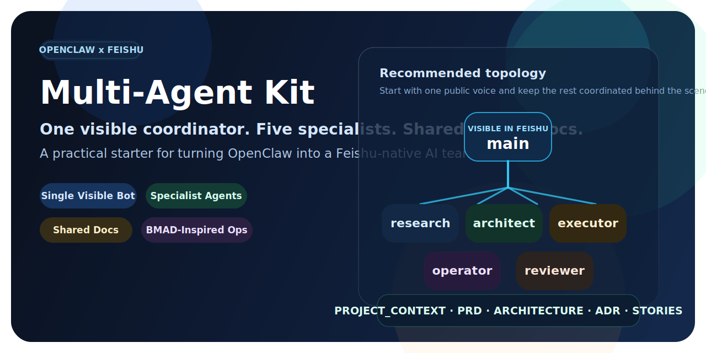
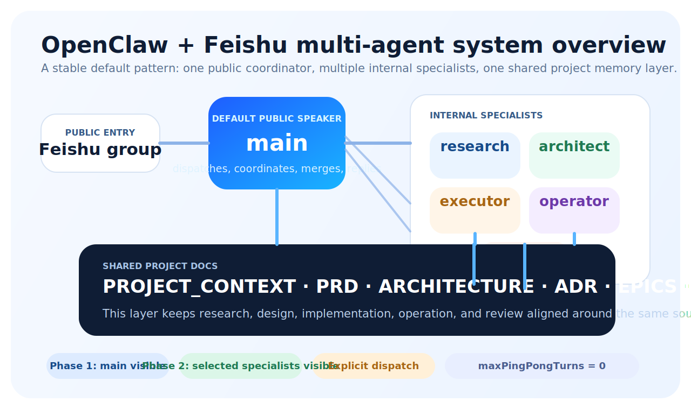

<div align="center">
  <h1>OpenClaw Feishu Multi-Agent Kit</h1>
  <p><strong>Turn one OpenClaw bot into a small Feishu-native AI team.</strong></p>
  <p>One visible coordinator, multiple specialist agents, shared project docs, and a cleaner operating model for real work.</p>
  <p>
    <a href="README_CN.md">中文文档</a> ·
    <a href="docs/BMAD_TO_OPENCLAW.md">BMAD Mapping</a> ·
    <a href="scripts/README.md">Scripts</a> ·
    <a href="project-docs/README.md">Project Docs</a>
  </p>
  <p>
    
    
    
    
    
  </p>
  <p>
    
  </p>
</div>

> Start with one bot your team can trust. Add specialist agents only where they improve quality.

This repository is a reusable starter kit for running OpenClaw as a role-based team in Feishu instead of a single all-purpose assistant.

It does not replace OpenClaw itself. It gives you:

- a multi-agent role layout that is easier to operate in group chat
- a single visible coordinator pattern that avoids noisy bot swarms
- shared project docs so agents do not improvise different rules
- a BMAD-inspired operating layer without dragging in the whole BMAD runtime

## Why This Exists

Most multi-agent OpenClaw experiments break down in predictable ways:

- every bot wants to talk
- roles blur after a few tasks
- execution starts before architecture is stable
- review happens without a shared baseline
- chat history becomes the only source of truth

This kit is designed to prevent that drift.

## At A Glance

| Layer | What it gives you |
| --- | --- |
| Runtime | OpenClaw + Feishu + multi-workspace + multi-agent routing |
| Coordination | One visible `main` agent that dispatches, merges, and replies |
| Specialists | `architect`, `research`, `executor`, `operator`, `reviewer` |
| Shared state | `PROJECT_CONTEXT`, `PRD`, `ARCHITECTURE`, ADRs, stories |
| Delivery model | Phase 1 for stability, Phase 2 for selective visibility |

## Architecture



### Core Design Principles

- `main` is the default public voice
- specialists work behind the scenes unless there is a strong reason to expose them
- shared docs come before parallel execution
- architecture and review are explicit roles, not afterthoughts
- `maxPingPongTurns = 0` keeps agent chatter under control

## Team Roles

| Role | Purpose | Typical output |
| --- | --- | --- |
| `main` | Coordinator, dispatcher, summarizer, final reply | task split, delegation, user-facing response |
| `architect` | Boundaries, architecture, ADRs, conflict prevention | design constraints, tradeoffs, ADRs |
| `research` | Information gathering and option comparison | findings, docs, decision inputs |
| `executor` | Code, config, CLI, deployment | implementation, patches, config changes |
| `operator` | Browser, UI, desktop, visible workflows | browser actions, UI verification, ops steps |
| `reviewer` | Validation, regression, risk control | test results, review findings, release checks |

## Delivery Path

| Phase | What is visible in Feishu | Why start here |
| --- | --- | --- |
| Phase 1 | `main` only | Lowest noise, easiest to stabilize |
| Phase 2 | `main`, optional `executor`, optional `reviewer` | Lets specialists speak publicly only when useful |

Recommended rule: do not start with five visible bots.

## What You Get In This Repo

| Directory | What it contains |
| --- | --- |
| [`config/`](config/) | Phase-based config snippets for OpenClaw |
| [`workspaces/`](workspaces/) | Role templates for each agent workspace |
| [`project-docs/`](project-docs/) | Shared engineering docs and templates |
| [`protocols/`](protocols/) | Group-chat operating rules |
| [`scripts/`](scripts/) | Bootstrap and config rendering helpers |
| [`examples/`](examples/) | Example docs showing how a real team setup can look |

## 3-Minute Quick Start

### 1. Bootstrap the target layout

```bash
bash ./scripts/bootstrap-openclaw-feishu-team.sh --target-root "$HOME/.openclaw"
```

This creates:

- role workspaces
- agent directories
- shared `project-docs/`
- starter files copied from this repository

### 2. Render a Phase 1 starter config

```bash
bash ./scripts/render-phase1-config.sh --target-root "$HOME/.openclaw"
```

You can also fill Feishu placeholders while rendering:

```bash
bash ./scripts/render-phase1-config.sh \
  --target-root "$HOME/.openclaw" \
  --group-id "oc_xxx" \
  --owner-open-id "ou_xxx" \
  --app-id "cli_xxx" \
  --app-secret "xxx"
```

### 3. Merge the generated config into your live OpenClaw config

Do not overwrite your full `openclaw.json`.

Merge only the relevant blocks:

- `agents`
- `bindings`
- `session.agentToAgent`
- `channels.feishu`

Start with:

- [`config/phase-1-single-visible-main.json5`](config/phase-1-single-visible-main.json5)

Later, upgrade to:

- [`config/phase-2-main-executor-reviewer.json5`](config/phase-2-main-executor-reviewer.json5)

### 4. Initialize the shared project docs

Copy templates from [`project-docs/templates/`](project-docs/templates/) into your target OpenClaw root:

- `PROJECT_CONTEXT.md`
- `PRD.md`
- `ARCHITECTURE.md`
- `adr/`
- `epics/`
- `stories/`

At minimum, fill out:

- `PROJECT_CONTEXT.md`
- `ARCHITECTURE.md`

before asking multiple agents to collaborate on real execution.

### 5. Test the coordinator workflow in Feishu

Start simple:

- mention `main`
- give it a small task
- confirm the routing and final reply feel correct

Then test delegation:

- ask for a task that needs research plus execution
- verify `main` remains the public voice
- confirm the result reflects shared docs instead of improvisation

## Shared Project Docs Chain

This repo treats documentation as part of the runtime, not decoration.

Recommended order:

1. `PROJECT_CONTEXT.md`
2. `PRD.md`
3. `ARCHITECTURE.md`
4. `adr/ADR-xxxx-*.md`
5. `epics/EPIC-*.md`
6. `stories/STORY-*.md`

Why it matters:

- `PROJECT_CONTEXT` aligns role boundaries
- `PRD` defines what should be built
- `ARCHITECTURE` defines how it should be built
- `ADR` records important tradeoffs
- `stories` give execution and review a shared task card

## Example Prompts

Once this kit is installed, the coordinator model can handle prompts like:

```text
Research the options first, let architect define the boundary, then let executor implement the safest path.
```

```text
Operator should handle the browser flow, then reviewer should check risk before we reply in the group.
```

```text
Break this feature request into roles and run it as a small team instead of a single bot.
```

## Who This Is For

This repo is a strong fit if you want to:

- run OpenClaw in Feishu group chats
- keep one clean public-facing bot while still using internal specialists
- move from chat-only collaboration to reusable engineering assets
- borrow the good parts of BMAD without adopting the whole stack

This repo is a weaker fit if you only need:

- one personal bot with no role separation
- free-form roleplay without workflow discipline
- desktop automation by itself

## Repository Map

```text
.
├── config/
├── docs/
├── examples/
├── project-docs/
├── protocols/
├── scripts/
├── workspaces/
├── README.md
├── README_CN.md
└── LICENSE
```

For a deeper breakdown, see:

- [`docs/BMAD_TO_OPENCLAW.md`](docs/BMAD_TO_OPENCLAW.md)
- [`scripts/README.md`](scripts/README.md)
- [`project-docs/README.md`](project-docs/README.md)
- [`protocols/FEISHU_GROUP_PROTOCOL.md`](protocols/FEISHU_GROUP_PROTOCOL.md)

## Roadmap Ideas

Good next improvements for a public version of this kit:

- config merge helpers instead of manual merge steps
- smoke tests for routing and role visibility
- screenshots or short diagrams for Feishu flows
- import-friendly examples for real OpenClaw deployments

## License

Released under the [MIT License](LICENSE).
