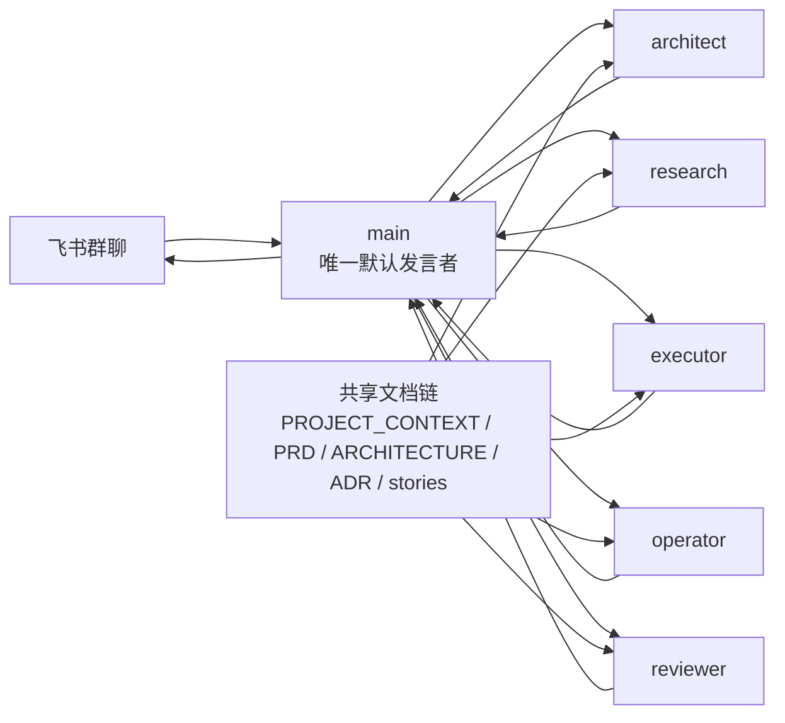

<div align="center">
  <h1>OpenClaw Feishu Multi-Agent Kit</h1>
  <p><strong>把一个 OpenClaw bot，升级成一支能在飞书里协作的小型 AI 团队。</strong></p>
  <p>一个对外协调者，多个内部专职角色，共享工程文档链，以及更稳的多 Agent 协作方式。</p>
  <p>
    <a href="README.md">English README</a> ·
    <a href="docs/BMAD_TO_OPENCLAW.md">BMAD 映射说明</a> ·
    <a href="scripts/README.md">脚本说明</a> ·
    <a href="project-docs/README.md">共享文档说明</a>
  </p>
  <p>
    
    
    
    
    
  </p>
</div>

> 先把一个对外 bot 做稳，再把真正有价值的专业角色放到它后面。

这个仓库不是 OpenClaw 本体，而是一套可以直接复用的 starter kit，用来把 OpenClaw 在飞书里的运行方式，从“一个 bot 什么都做”升级成“一个协调者 + 多个专职角色”的工程化协作模式。

它主要提供四件事：

- 一套更适合飞书群聊的多角色分工方式
- 一个“单可见协调者”的默认落地模型，避免 bot 满屏抢话
- 一层共享工程文档，让角色不会各自发明规则
- 一套借鉴 BMAD、但不强绑定 BMAD 运行时的方法层

## 这个仓库解决什么问题

很多 OpenClaw 多 Agent 方案最后会卡在这些地方：

- 角色都想说话，群里变得很吵
- 做着做着人设和职责开始串
- 代码先写了，架构还没定
- 审查只是“看一眼”，没有统一标准
- 所有信息都埋在聊天记录里，没法复用

这个仓库的目标，就是把这些高频混乱提前设计掉。

## 一眼看懂

| 层次 | 提供什么 |
| --- | --- |
| 运行时层 | OpenClaw + Feishu + multi-workspace + multi-agent 路由 |
| 协调层 | 一个可见 `main`，负责派工、汇总、最终答复 |
| 专职层 | `architect`、`research`、`executor`、`operator`、`reviewer` |
| 共享状态 | `PROJECT_CONTEXT`、`PRD`、`ARCHITECTURE`、ADR、story |
| 落地节奏 | 先 Phase 1 稳定，再 Phase 2 选择性放出可见角色 |

## 架构图



### 核心设计原则

- `main` 是默认对外声音
- 专家角色优先在后台工作，不轻易全部暴露出来
- 共享文档先于并行执行
- 架构与审查必须显式存在，不能只靠执行角色自己兼任
- `maxPingPongTurns = 0`，尽量从配置层避免 Agent 互相客套刷屏

## 角色分工

| 角色 | 主要职责 | 典型产出 |
| --- | --- | --- |
| `main` | 统筹、派工、汇总、最终回复 | 任务拆解、派工说明、对外答复 |
| `architect` | 架构、边界、ADR、冲突治理 | 方案边界、架构约束、ADR |
| `research` | 资料搜集、文档整理、方案对比 | 调研结论、参考资料、输入建议 |
| `executor` | 代码、配置、命令、部署 | 实现结果、脚本、配置修改 |
| `operator` | 浏览器、UI、桌面、前台流程 | 页面操作、UI 验证、流程执行记录 |
| `reviewer` | 验证、回归、风险控制 | 审查意见、测试结果、上线检查 |

## 推荐落地路径

| 阶段 | 飞书里谁可见 | 为什么这样做 |
| --- | --- | --- |
| Phase 1 | 只可见 `main` | 最稳，最容易把协作链跑顺 |
| Phase 2 | `main`，可选 `executor`，可选 `reviewer` | 让专业角色在必要时出面，但群里仍然可控 |

一个很重要的建议：不要一上来就做 5 个可见 bot。

## 这个仓库里有什么

| 目录 | 作用 |
| --- | --- |
| [`config/`](config/) | OpenClaw 的分阶段配置片段 |
| [`workspaces/`](workspaces/) | 每个角色的 workspace 模板 |
| [`project-docs/`](project-docs/) | 多角色共享的工程文档与模板 |
| [`protocols/`](protocols/) | 群聊协作协议和约束 |
| [`scripts/`](scripts/) | 初始化目录和渲染配置的辅助脚本 |
| [`examples/`](examples/) | 一套更接近真实项目的示例资料 |

## 3 分钟快速开始

### 1. 先把目录骨架搭起来

```bash
bash ./scripts/bootstrap-openclaw-feishu-team.sh --target-root "$HOME/.openclaw"
```

这一步会帮你创建：

- 各角色 workspace
- 各角色 agent 目录
- 共享 `project-docs/`
- 从本仓库复制过去的 starter 文件

### 2. 渲染一个 Phase 1 配置起点

```bash
bash ./scripts/render-phase1-config.sh --target-root "$HOME/.openclaw"
```

如果你想顺手把 Feishu 的关键占位符一起填掉，也可以这样：

```bash
bash ./scripts/render-phase1-config.sh \
  --target-root "$HOME/.openclaw" \
  --group-id "oc_xxx" \
  --owner-open-id "ou_xxx" \
  --app-id "cli_xxx" \
  --app-secret "xxx"
```

### 3. 把生成的配置合并进你的 OpenClaw 配置

不要整份覆盖 `openclaw.json`。

通常只需要合并这些块：

- `agents`
- `bindings`
- `session.agentToAgent`
- `channels.feishu`

第一阶段先从这里开始：

- [`config/phase-1-single-visible-main.json5`](config/phase-1-single-visible-main.json5)

稳定后再看：

- [`config/phase-2-main-executor-reviewer.json5`](config/phase-2-main-executor-reviewer.json5)

### 4. 初始化共享文档链

把 [`project-docs/templates/`](project-docs/templates/) 里的模板落到你的目标 OpenClaw 根目录：

- `PROJECT_CONTEXT.md`
- `PRD.md`
- `ARCHITECTURE.md`
- `adr/`
- `epics/`
- `stories/`

最少也建议先写：

- `PROJECT_CONTEXT.md`
- `ARCHITECTURE.md`

再让多个角色一起真正干活。

### 5. 在飞书里先验证协调者链路

先用简单任务测试：

- `@main`
- 给一个小任务
- 看路由和回复风格是否符合预期

再测试多角色协作：

- 给一个需要 research + executor 的任务
- 确认对外仍然是 `main`
- 确认输出是围绕共享文档，而不是临场乱发挥

## 共享文档链为什么重要

这套方案里，文档不是装饰，而是运行时的一部分。

推荐顺序：

1. `PROJECT_CONTEXT.md`
2. `PRD.md`
3. `ARCHITECTURE.md`
4. `adr/ADR-xxxx-*.md`
5. `epics/EPIC-*.md`
6. `stories/STORY-*.md`

它们分别解决的问题：

- `PROJECT_CONTEXT`
  统一边界、角色和协作基线
- `PRD`
  定义做什么
- `ARCHITECTURE`
  定义怎么做
- `ADR`
  记录关键取舍
- `story`
  让执行和审查围绕同一张任务卡工作

## 可直接参考的指令风格

装好这套 kit 之后，`main` 可以比较自然地接这种任务：

```text
先让 research 查资料，再让 architect 给边界，最后让 executor 落地。
```

```text
这个网页流程交给 operator 操作，做完让 reviewer 检查风险，然后 main 再汇总回复。
```

```text
把这个需求拆成多个角色去做，不要按单 bot 方式硬顶。
```

## 适合谁

这套仓库比较适合你，如果你想：

- 在飞书群里跑 OpenClaw
- 保持一个干净的对外 bot，同时让内部专家协作
- 把聊天协作沉淀成可复用的工程资产
- 借 BMAD 的优点，但不把整套运行时都搬进来

如果你只是需要：

- 一个简单的个人助理 bot
- 没有流程约束的多 bot 角色扮演
- 单纯桌面自动化本身

那它就不一定是最合适的选择。

## 仓库结构

```text
.
├── config/
├── docs/
├── examples/
├── project-docs/
├── protocols/
├── scripts/
├── workspaces/
├── README.md
├── README_CN.md
└── LICENSE
```

继续往下看时，推荐这些文档：

- [`README.md`](README.md)
- [`docs/BMAD_TO_OPENCLAW.md`](docs/BMAD_TO_OPENCLAW.md)
- [`scripts/README.md`](scripts/README.md)
- [`project-docs/README.md`](project-docs/README.md)
- [`protocols/FEISHU_GROUP_PROTOCOL.md`](protocols/FEISHU_GROUP_PROTOCOL.md)

## 后续还可以继续增强

如果你准备把它继续打磨成更成熟的公开项目，下一批最值得补的东西是：

- 配置自动合并脚本，减少手工 patch
- 路由与角色可见性的 smoke test
- 飞书实际流程截图或简图
- 更接近真实 OpenClaw 部署的导入示例

## License

使用 [MIT License](LICENSE)。
